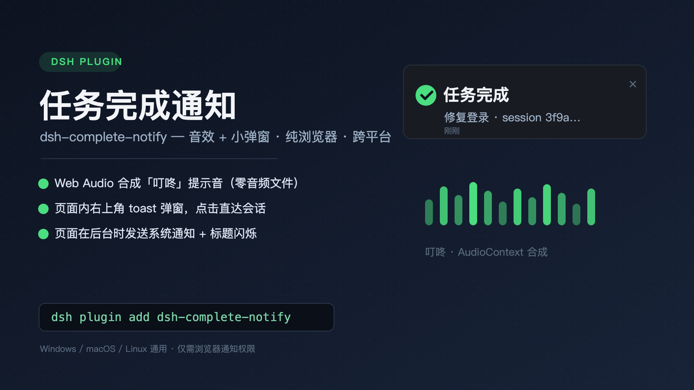

# dsh-complete-notify

<p align="center">
  
</p>

DeepSeek Harness（DSH）任务完成通知插件：任务完成时播放**提示音**并弹出**小通知**。

- **纯浏览器方案**：音效用 Web Audio 合成、弹窗是页面内 toast、页面在后台时改用系统通知（Web Notification API）——零系统依赖、零音频文件，Windows / macOS / Linux 通用
- **不依赖任何系统通知命令**（无 osascript / notify-send / PowerShell），通知权限是浏览器站点级授权，授权一次即可
- 与官方运行指示灯同源的完成检测：会话列表快照的 `running` / `completed` 状态

## 安装

```sh
dsh plugin --profile web add link:/path/to/dsh-complete-notify
# 重启 dsh web 生效（launchd 托管时）：
launchctl kickstart -k gui/$(id -u)/com.dsh.dsh-web
```

## 使用

1. 任务完成后：听到「叮咚」提示音 + 右上角弹出「✓ 任务完成」小卡片（含会话标题，点击跳转到该会话，5 秒自动消失）
2. 页面切到后台/其他标签页时完成任务：收到**系统通知**（点击通知会聚焦窗口并打开对应会话）+ 提示音 + 标签页标题闪烁
3. **设置 → 任务完成通知**：
   - 启用提醒 / 提示音 / 系统通知（页面在后台时）开关、音量滑块
   - 「测试音效」「测试通知」按钮；首次点「测试通知」会请求浏览器通知权限，点**允许**
   - 全部设置保存在浏览器 localStorage（`dsh.completeNotify.v1`）

## 行为细节

| 场景 | 行为 |
|---|---|
| 页面可见，任一会话完成 | toast + 音效 |
| 页面在后台，会话完成 | 系统通知 + 音效 + 标题闪烁 |
| 系统通知权限被拒 | 降级为长时 toast（30 秒，回来也能看到）+ 标题闪烁 |
| 一次完成 | 只提醒一次（按会话去重，重新运行后再完成会再次提醒） |
| 子代理（subagent）会话 | 不提醒 |
| 多会话同时完成 | toast 栈最多 3 条（FIFO） |

## 已知限制

- 标签页必须开着（浏览器限制）；标签页关闭后系统通知也收不到。如需关页推送可后续接 Push API（需推送服务器）
- v0.1 不区分任务成功/失败，统一「任务完成」；后续可从会话快照的 `turn/end` reason 上色
- toast 为深色样式，暂未跟随明暗主题切换
- 浏览器自动播放策略：首次用户交互（点击/按键）后音效才可用——DSH 里发第一条消息时即自然解锁

## 开发

```sh
node --test tests/    # 完成检测状态机单测（通过 stub 执行同一份 client/client.js）
npm run check         # 语法检查
```

结构：

```
lib/index.js      # 宿主半空壳（无逻辑）
client/client.js  # 客户端单文件（DSH 模块加载器格式；全部逻辑在此）
cordis.patch.yml  # bundle insert 声明
tests/            # node --test 单测
```

## 卸载

```sh
dsh plugin --profile web remove dsh-complete-notify
```

## License

MIT
